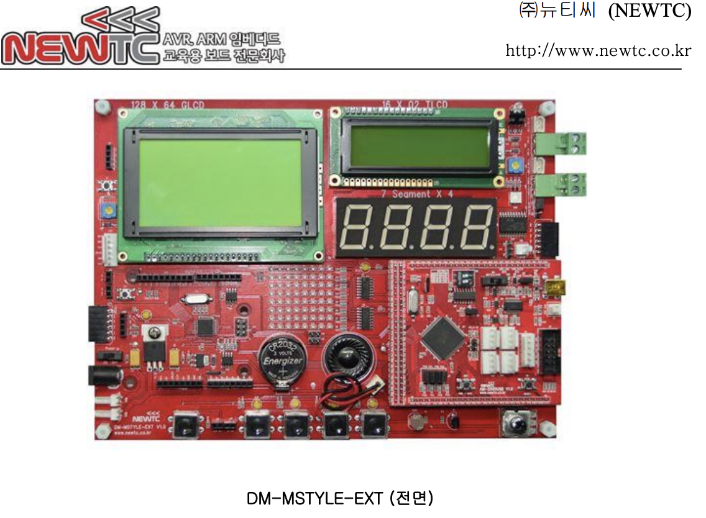

# 🛠 Hardware Specification

본 프로젝트는 **Arduino Mega 2560 (Original)** 보드와 **NEWTC사의 DM-MSTYLE-EXT V1.0** 확장 베이스 보드를 결합하여 구현되었습니다.

---

### 1. Main System Components
*   **MCU Board**: Arduino Mega 2560 (R3)
*   **Base Board**: DM-MSTYLE-EXT V1.0 (Multi-purpose Extension Board)
*   **Clock Speed**: 16MHz
*   **Power**: USB 5V Supply

### 2. Physical Layout & Configuration
  
*(이미지 설명: 아두이노 메가와 DM-MSTYLE-EXT V1.0이 결합된 실습 환경입니다.)*

| Device | Arduino Pin | MCU Port | Logic Type | Role |
| :--- | :--- | :--- | :--- | :--- |
| **LED 1~4** | D2, D3, D4, D5 | PE4, PE5, PG5, PE3 | Active High | 모드별 점멸 출력 |
| **Switch 1** | **D21** | **PD0** | **Active Low** | **INT0** (외부 인터럽트 0) |
| **Switch 2** | **D15** | **PJ0** | **Active High** | **PCINT9** (핀 변화 인터럽트 1) |

---

### 3. Circuit Mechanism (Interrupts)

#### [INT0] External Interrupt (D21 / PD0)
*   **회로 설계**: 스위치가 핀과 GND 사이에 배치된 구조입니다.
*   **동작 원리**: 평상시 1(High)을 유지하다 버튼을 누를 때 0(Low)으로 떨어지는 **Falling Edge**를 감지합니다.
*   **설정**: `set_bit(PORTD, 0)`을 통해 MCU 내부의 **내장 풀업 저항**을 활성화하였습니다.

#### [PCINT1] Pin Change Interrupt (D15 / PJ0)
*   **회로 설계**: **DM-MSTYLE-EXT** 보드 내에 **물리적 외부 풀다운 저항**이 탑재되어 있습니다.
*   **동작 원리**: 버튼을 누를 때 0(Low)에서 1(High)로 변하는 신호를 감지합니다.
*   **설정**: 외부 저항이 존재하므로 별도의 내부 풀업 없이 입력 방향(`DDRJ`) 설정만으로 동작합니다.

---

### 4. Technical Summary
*   **Data Integrity**: 인터럽트 발생 시 공유 변수(`mode`)의 안정적인 복사를 위해 `ATOMIC_BLOCK`을 적용하였습니다.
*   **Reliability**: `volatile` 키워드를 사용하여 하드웨어 이벤트에 의한 변수 값 변화를 컴파일러가 실시간으로 반영하도록 설계하였습니다.